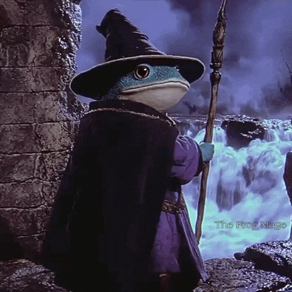

# 🎮 Super Pablo 3: La Última Batalla

## 👥 Integrantes del grupo

- Santiago Papale
- Octavio Romero
- Matias Rodrigo Zurita

---

## 📖 Descripción

**Super Pablo 3: La Última Batalla** es un videojuego de acción y aventura en **2D** con vista lateral (*side-view*), desarrollado en **Java** utilizando el framework **LibGDX**. El juego representa la tercera y última entrega de la saga **Super Pablo**, donde dos jugadores deberán cooperar para recorrer distintos escenarios, enfrentarse a enemigos y jefes finales, obtener reliquias y detener definitivamente a **El Retumbar**, la entidad responsable de la corrupción del mundo.



---

## 🎯 Características principales

- Videojuego de acción y aventura en 2D.
- Vista lateral (*side-view*).
- Modo cooperativo para dos jugadores mediante red local (LAN).
- Arquitectura Cliente-Servidor.
- Sistema de combate cuerpo a cuerpo y a distancia.
- Enemigos con distintos comportamientos.
- Jefe final.
- NPCs e historia original.
- Sistema de reliquias para progresar en la campaña.

---

## 🚀 Tecnologías utilizadas

- **Java 8 (JDK 1.8)**
- **LibGDX 1.14.1**
- **Gradle**
- **Git & GitHub**

### Plataformas objetivo

- 💻 Escritorio (Windows/Linux/macOS)

---

## 📌 Estado actual del proyecto

🚧 **Configuración inicial y estructura del proyecto.**

Actualmente el proyecto se encuentra en la etapa inicial de desarrollo, con la configuración del entorno, la organización del repositorio y la planificación de las funcionalidades principales.

---

## ⚙️ Cómo compilar y ejecutar

### 1. Clonar el repositorio

```bash
git clone https://github.com/Octa-Romero/SuperPablo3.git
```

### 2. Abrir el proyecto

Abrir el proyecto con un IDE compatible con Gradle, por ejemplo:

- IntelliJ IDEA
- Eclipse
- Visual Studio Code (con soporte para Java)

### 3. Descargar las dependencias

Gradle descargará automáticamente todas las dependencias de LibGDX al abrir el proyecto.

### 4. Ejecutar el juego

Ejecutar la clase principal del módulo **lwjgl3** (`Lwjgl3Launcher.java`).

También es posible ejecutar desde la terminal:


En Windows:

```bash
gradlew lwjgl3:run
```

Linux / maxOS:

```
./gradlew lwjgl3:run
```

## Wiki del Proyecto

La propuesta detallada del videojuego se encuentra disponible en la [Wiki del proyecto](https://github.com/Octa-Romero/SuperPablo3/wiki).---

## 📄 Licencia

Proyecto desarrollado con fines educativos para la materia **Programación sobre Redes**.
